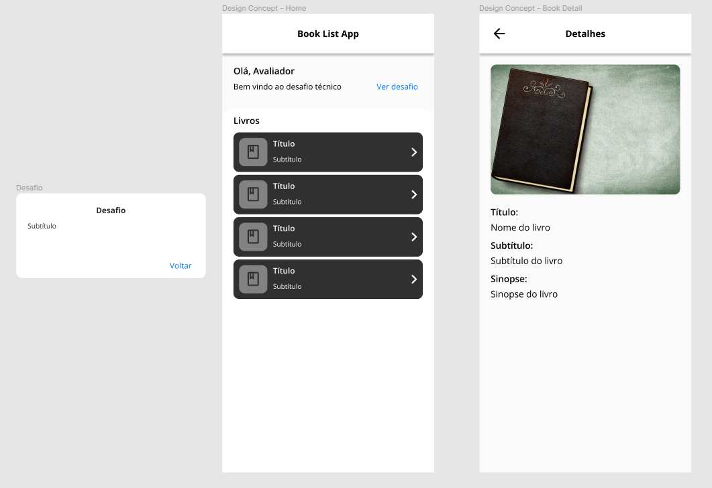

<h1 align="center">Book List App</h1>

Um aplicativo em Flutter que acessa uma API e apresenta titulos de livros.
	<a href="https://62507208977373573f3d77f0.mockapi.io/api/lib/library">📄  API</a>

<h3 align="center">
    <a href="https://flutter.dev">🔗 Flutter</a>
    <a href="https://dart.dev">🔗 Dart</a>
</h3>

	
	
	

<h2 align="center"> 
	📚  Flutter Project 💻  Finalizado ✅ 
</h2>

<h3 align="center">UI Design Concept</h3>

  

